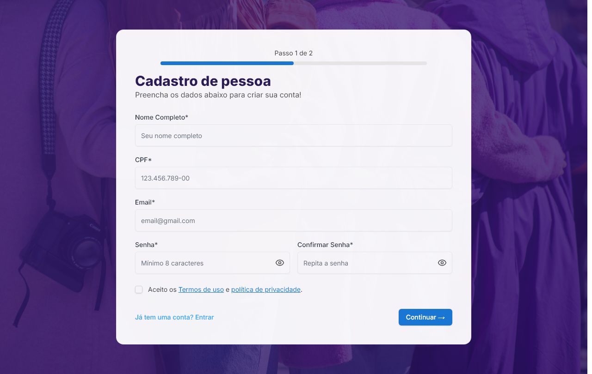
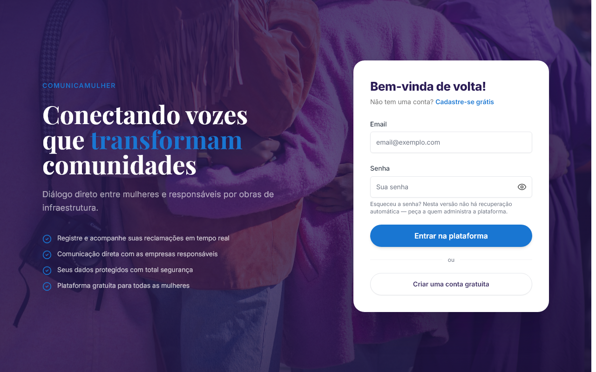
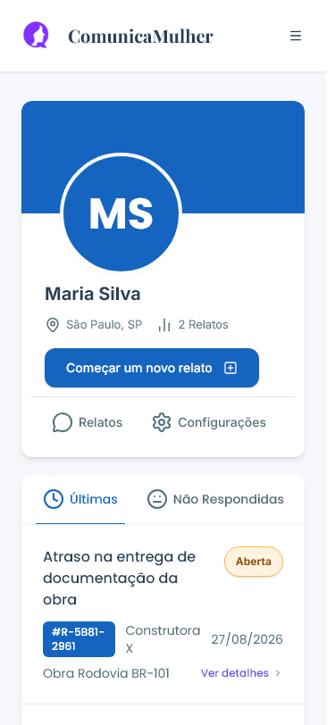
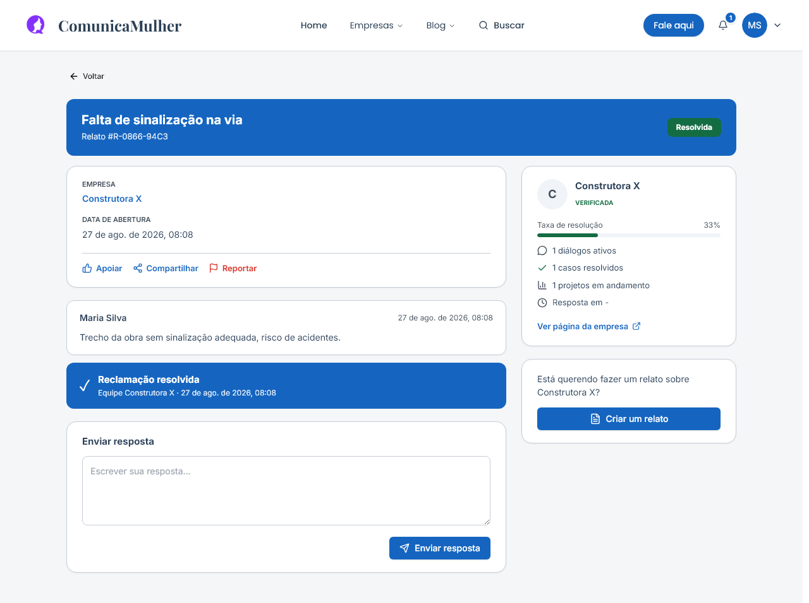

# Manual de Uso — ComunicaMulher

**Primeira versão · agosto de 2026**

Este manual ensina a usar a plataforma ComunicaMulher. Ele é feito para você
seguir com a tela aberta na frente: cada passo tem uma foto do que você vai ver.

Você não precisa saber nada de computador para usar este manual. Se em algum
ponto aparecer uma palavra que você não conhece, ela está explicada no
[glossário](#glossário), no fim.

> **Sobre esta versão.** A plataforma ainda está em construção. Este manual
> descreve **o que ela faz hoje**, e diz com clareza o que ela ainda não faz —
> ver [O que esta versão ainda não faz](#o-que-esta-versão-ainda-não-faz). Um
> manual que promete o que não existe atrapalha mais do que ajuda.

---

## Índice

1. [O que é a plataforma e para quem](#1-o-que-é-a-plataforma-e-para-quem)
2. [Criar sua conta](#2-criar-sua-conta)
3. [Registrar um relato](#3-registrar-um-relato)
4. [Acompanhar seu relato e conversar com a empresa](#4-acompanhar-seu-relato-e-conversar-com-a-empresa)
5. [Quando o relato é resolvido](#5-quando-o-relato-é-resolvido)
6. [Para empresas: receber e responder](#6-para-empresas-receber-e-responder)
7. [Perguntas frequentes](#7-perguntas-frequentes)
8. [Onde buscar ajuda](#8-onde-buscar-ajuda)
- [O que esta versão ainda não faz](#o-que-esta-versão-ainda-não-faz)
- [Glossário](#glossário)

---

## 1. O que é a plataforma e para quem

A ComunicaMulher liga **mulheres afetadas por obras** às **empresas
responsáveis por essas obras**.

Obras de infraestrutura — estradas, pontes, saneamento, energia — mudam a vida
de quem mora perto. Barulho de madrugada, rua sem sinalização, poeira, caminhão
passando na porta de casa. Reclamar disso costuma significar telefone que não
atende e protocolo que se perde.

Aqui funciona assim: **você escreve o que está acontecendo, a empresa responde
na mesma tela, e o histórico fica registrado.** A conversa não se perde, e você
pode acompanhar do celular.

*A página inicial. O campo de busca no centro procura pelo nome da empresa ou
do órgão responsável pela obra.*

### A plataforma é para você que...

- mora perto de uma obra e está sendo afetada por ela;
- já tentou reclamar por telefone e não conseguiu resposta;
- quer que fique registrado que você reclamou, e quando.

### E também para empresas

Empresas que executam obras usam a plataforma para receber os relatos, responder
e acompanhar o que já foi resolvido. A [seção 6](#6-para-empresas-receber-e-responder)
é sobre isso.

### Você pode olhar sem se cadastrar

Antes de criar conta, você pode ver quais empresas estão na plataforma e o que
já foi relatado sobre cada uma.

*A página de uma empresa. Qualquer pessoa pode abrir esta página, mesmo sem
conta. É aqui que se vê como a empresa vem respondendo.*

O selo **VERIFICADA** quer dizer que a plataforma conferiu os documentos da
empresa. A **taxa de resolução** é a porcentagem de relatos que a empresa já
concluiu.

---

## 2. Criar sua conta

Você precisa de conta para registrar um relato. Leva menos de dois minutos.

### Passo 1 — Escolha o tipo de conta

Clique em **Cadastrar**, no canto superior direito da tela.

*A escolha do tipo de conta. Se você quer registrar um problema, escolha
**Pessoa**.*

Clique em **Continuar como pessoa**.

### Passo 2 — Preencha seus dados

*O formulário de cadastro. Os campos marcados com asterisco são obrigatórios.*

O que preencher:

| Campo | O que colocar |
|---|---|
| **Nome Completo** | Seu nome. Você poderá escondê-lo dos relatos depois, se quiser |
| **CPF** | Só números. A plataforma coloca os pontos sozinha |
| **Email** | Um e-mail que você use. É com ele que você entra |
| **Senha** | No mínimo 8 letras ou números. Use uma que você lembre |
| **Confirmar Senha** | A mesma senha, de novo |

Marque a caixa aceitando os termos de uso e clique em **Continuar**.

> ⚠️ **Guarde sua senha em lugar seguro.** Nesta versão da plataforma **não é
> possível recuperar a senha esquecida**. O link "Esqueceu a senha?" na tela de
> entrada ainda não leva a lugar nenhum.

### Passo 3 — Entre na plataforma

*A tela de entrada. Você chega aqui clicando em **Entrar**, no alto da página.*

---

## 3. Registrar um relato

Esta é a tarefa principal da plataforma. São **quatro etapas**, e a barra no
alto mostra em qual você está. Você pode voltar a qualquer momento sem perder o
que já escreveu.

> **Duas palavras para a mesma coisa.** A plataforma às vezes diz *relato* e às
> vezes diz *reclamação*. São a mesma coisa. Neste manual usamos **relato**.

### Como começar

Há dois caminhos:

- Na página da empresa, clique no botão **Reclamar**, no alto à direita.
- Ou, já dentro da sua conta, clique em **Começar um novo relato**.

### Etapa 1 — Histórico

*Etapa 1. A resposta "Não, é a primeira vez" já vem marcada.*

A pergunta é se você já reclamou desse problema em outro lugar — na prefeitura,
por telefone, no ouvidor da empresa.

- Se **não** reclamou, não precisa mexer em nada. Clique em **Continuar**.
- Se **já** reclamou, marque "Sim, já reclamei". Vão aparecer campos para você
  contar onde e quando. Isso ajuda a empresa a entender que o caso não é novo.

### Etapa 2 — Descrição

Esta é a etapa mais importante. É aqui que você conta o que está acontecendo.

*Etapa 2. O exemplo mostra o tipo de detalhe que ajuda: o que acontece, desde
quando, e como isso afeta você.*

| Campo | O que escrever |
|---|---|
| **Qual é o problema?** | Uma frase curta. "Barulho de obra depois das dez da noite" |
| **Conte com mais detalhes** | Quando começou, com que frequência, como afeta você. Escreva do seu jeito |
| **Onde aconteceu?** | O endereço ou um ponto de referência. "Em frente ao mercado da esquina" serve |

Escreva com suas palavras. Não precisa de linguagem formal e não precisa de
termo técnico. Quanto mais concreto, melhor: *"as máquinas trabalham até as duas
da manhã e minha filha não consegue dormir"* diz muito mais do que *"incômodo
sonoro"*.

> 🔒 **Não escreva CPF, RG, número de cartão ou senha nesses campos.** A própria
> tela avisa isso. Esses dados não são necessários, e o relato pode ficar
> visível para outras pessoas.

O botão **Continuar** só fica ativo quando o título tem pelo menos 3 letras e a
descrição pelo menos 10. Se ele estiver apagado, é porque falta preencher.

### Etapa 3 — Fotos

*Etapa 3. Enviar foto é opcional — o botão diz **Continuar sem foto**.*

Foto ajuda muito. Uma imagem da rua sem sinalização, do buraco, do caminhão
estacionado na calçada — isso é prova, e a empresa não tem como dizer que não
sabia.

**Antes de anexar, leia o aviso azul da tela:** quem puder ver o relato também
vai poder abrir o arquivo. Se você marcar o relato como público na etapa
seguinte, isso inclui qualquer pessoa cadastrada. Não anexe documento com dado
pessoal — seu ou de outra pessoa.

Se não tiver foto, clique em **Continuar sem foto**. Você não perde nada por
isso.

> ⚠️ **Atenção ao tamanho.** A tela diz "até 3 arquivos, máximo 5 MB cada", mas
> nesta versão o envio aceita **1 arquivo de até 4 MB**. Se der erro no envio,
> tente com um arquivo só e menor. Isso já está registrado para correção.

### Etapa 4 — Finalizar

*Etapa 4. As duas chaves no fim decidem quem vai ver seu nome e quem vai ver o
relato.*

Três escolhas obrigatórias:

- **Qual tipo de problema?** — saúde, mobilidade, patrimônio, meio ambiente,
  infraestrutura, direitos.
- **Quão urgente é?** — baixa, média ou alta. Escolha pelo tamanho do incômodo.
- **Quem mais está sendo afetado?** — só você, sua família, ou vizinhos e
  comunidade. Um problema que afeta a rua inteira pesa diferente de um que
  afeta uma casa.

E uma opcional: **qual projeto da empresa**. Se você não souber o nome da obra,
deixe em branco. A tela mesmo diz "só escolha se souber".

#### As duas chaves do fim — leia com atenção

| Chave | Se ligada | Se desligada |
|---|---|---|
| **Quero fazer este relato sem mostrar meu nome** | Onde apareceria seu nome, vai aparecer "Autora anônima". Nem a empresa vê quem você é | Seu nome aparece para a empresa e, se o relato for público, para quem abrir a página |
| **Quero que outras pessoas possam ver este relato** | O relato aparece na página pública da empresa | Só você, a empresa e a administração da plataforma veem |

A segunda chave **já vem ligada**. Se você não quiser que seu relato apareça na
página pública da empresa, desligue-a antes de enviar.

Escolhida a configuração, clique em **Enviar relato**.

### Pronto

Aparece uma tela de confirmação com o **número do relato** — algo como
`#R-A965-18D5`. Anote esse número. É por ele que você identifica seu relato
quando falar com alguém sobre o caso.

---

## 4. Acompanhar seu relato e conversar com a empresa

### Onde ficam seus relatos

Clique na sua foto ou nas suas iniciais, no canto superior direito, e vá em
**Relatos**.

*Sua lista de relatos. As abas separam por situação.*

No celular a mesma página fica em uma coluna só:

*A mesma tela no celular.*

### O que cada etiqueta quer dizer

| Etiqueta | Quer dizer |
|---|---|
| **Aberta** | A empresa ainda não respondeu |
| **Respondida** | A empresa respondeu. É sua vez, se quiser continuar |
| **Resolvida** | A empresa marcou o caso como encerrado |
| **Cancelada** | O relato foi cancelado |

### Abrir um relato

Clique em **Ver detalhes**.

*Um relato ainda sem resposta da empresa.*

Na página do relato você tem:

- **Apoiar** — outras pessoas podem apoiar seu relato, mostrando que o problema
  não é só seu.
- **Compartilhar** — copia o endereço da página, para você mandar por mensagem.
- **Reportar** — para avisar a administração se algo estiver errado.
- No lado direito, os números da empresa e um link para a página dela.

### Quando a empresa responde

*Uma conversa. Este relato foi feito sem mostrar o nome — repare em "Autor
(anônimo)" no lugar do nome da autora.*

A resposta da empresa aparece logo abaixo do seu texto, com o nome de quem
respondeu e a data. Para continuar a conversa, escreva na caixa **Enviar
resposta** e clique no botão.

Você pode responder quantas vezes precisar. Tudo fica registrado, na ordem.

---

## 5. Quando o relato é resolvido

Quem encerra o caso é a empresa. Quando ela faz isso, sua página muda:

*Um relato resolvido. A faixa azul diz quem encerrou e quando.*

### E se o problema não foi resolvido de verdade?

Acontece: a empresa marca como resolvida e o barulho continua.

Nesta versão da plataforma, **responder num relato resolvido não o reabre**. A
caixa de resposta continua ali e sua mensagem é registrada — a empresa vai ler —
mas a etiqueta continua "Resolvida".

O que fazer:

1. **Responda no mesmo relato**, dizendo que o problema continua. Fica
   registrado, com data.
2. **Se não houver retorno, registre um relato novo**, mencionando o número do
   anterior no texto. Assim fica claro que é reincidência.

A reabertura automática está registrada para ser implementada.

---

## 6. Para empresas: receber e responder

Esta seção é para quem trabalha na empresa e vai responder aos relatos.

### O painel

Ao entrar com uma conta de empresa, você chega ao painel:

*O painel da empresa. O número **Sem resposta** é o que exige ação.*

Os cinco números do alto:

| Número | O que é |
|---|---|
| **Reclamações recebidas** | Total de relatos sobre a empresa |
| **Casos resolvidos** | Quantos já foram encerrados |
| **Sem resposta** | **Quantos ainda esperam.** É este que exige ação |
| **Taxa de resolução** | Porcentagem de encerrados. Aparece na página pública |
| **Projetos ativos** | Obras em andamento cadastradas |

A **taxa de resolução é pública**: aparece na página que qualquer pessoa pode
abrir. Responder e encerrar não é só cortesia — é o que a plataforma mostra
sobre a empresa.

### Ler e responder

Clique em **Ver detalhes** em qualquer relato da lista.

*A tela de resposta da empresa. À direita, em **Ações da empresa**, fica a
mudança de situação.*

Para responder:

1. Escreva na caixa **Enviar resposta**.
2. Se precisar anexar documento — uma autorização, um cronograma — use
   **Anexar arquivo**.
3. Clique em **Enviar resposta**.

Para mudar a situação do caso:

1. No quadro **AÇÕES DA EMPRESA**, à direita, abra a lista **Mudar status**.
2. Escolha a nova situação.
3. Clique em **Salvar**.

### Quando o relato é anônimo

Se a autora escolheu não mostrar o nome, você vê **"Autora anônima"** — e é só
isso que existe do lado da empresa. O nome não fica escondido atrás de um
clique: ele não é enviado.

Você continua podendo responder normalmente. A resposta chega a ela.

### Como escrever uma boa resposta

Do outro lado há uma pessoa que já tentou reclamar por outros caminhos e não
conseguiu. Três coisas que fazem diferença:

- **Diga o prazo.** "Vamos verificar" não informa nada. "Vamos verificar e
  retornamos em até 48 horas" informa.
- **Diga o que foi feito, não só o que será feito.** "A equipe foi ao local hoje
  de manhã" vale mais que uma promessa.
- **Não encerre antes de resolver.** A taxa de resolução é pública, mas o
  relato também é — encerrar um caso que continua acontecendo fica visível.

---

## 7. Perguntas frequentes

**Preciso pagar alguma coisa?**
Não. A plataforma é gratuita para quem registra relatos.

**Posso relatar sem que ninguém saiba que fui eu?**
Sim. Na etapa 4, ligue a chave **"Quero fazer este relato sem mostrar meu
nome"**. Seu nome não é enviado para a empresa nem aparece na página pública.
A plataforma continua sabendo quem você é — é assim que você acompanha o caso
depois.

**Quem consegue ver meu relato?**
Depende da segunda chave da etapa 4. Se **Quero que outras pessoas possam ver
este relato** estiver ligada (é o padrão), o relato aparece na página pública da
empresa. Se estiver desligada, só você, a empresa e a administração da
plataforma.

**Posso mudar isso depois de enviar?**
Não nesta versão. Decida antes de clicar em **Enviar relato**.

**Esqueci minha senha. E agora?**
Nesta versão não há recuperação de senha. Você precisará de outra conta, com
outro e-mail. É uma limitação conhecida e está registrada para correção.

**Quanto tempo a empresa tem para responder?**
A plataforma não impõe prazo. O que ela faz é **mostrar**: o número "Sem
resposta" e a taxa de resolução ficam visíveis na página pública da empresa.

**A empresa pode apagar meu relato?**
Não. A empresa pode responder e mudar a situação do caso. Não pode apagar.

**Serei avisada quando a empresa responder?**
Nesta versão, **não chega aviso por e-mail**. Você precisa entrar na plataforma
e olhar. O sino no alto da tela mostra novidades enquanto você está dentro.

**Posso relatar sobre qualquer empresa?**
Só sobre as que estão cadastradas. Use **Empresas** no menu, ou o campo de busca
da página inicial, para ver quais são.

**Funciona no celular?**
Sim. Todas as telas deste manual foram conferidas em tela de celular. O menu
vira o botão de três riscos no canto superior direito.

**Meu relato apareceu com meu nome e eu não queria. O que faço?**
Registre o caso pelo botão **Reportar**, na página do relato, e explique. A
administração da plataforma consegue agir.

---

## 8. Onde buscar ajuda

Aqui é preciso ser honesto: **esta versão da plataforma não tem canal de
atendimento**. Não há telefone, não há e-mail de suporte, não há chat.

O que existe hoje:

| Se você precisa de... | Use |
|---|---|
| entender como usar a plataforma | este manual |
| avisar sobre algo errado num relato | o botão **Reportar**, na página do relato |
| falar com a empresa | a caixa **Enviar resposta**, dentro do relato |
| ler sobre direitos e casos | a seção **Blog**, no menu do alto |

Se o problema for **urgente e envolver risco** — obra sem sinalização em via
movimentada, risco de desabamento, vazamento — **não use só a plataforma**.
Procure a defesa civil, a prefeitura ou o órgão fiscalizador da sua cidade. A
plataforma registra e cobra; ela não substitui a fiscalização.

---

## O que esta versão ainda não faz

Lista honesta, para você não perder tempo procurando:

| Não faz | O que isso significa na prática |
|---|---|
| **Não envia e-mail** | Nenhum: nem confirmação de cadastro, nem aviso de resposta, nem recuperação de senha. Você precisa entrar e olhar |
| **Não recupera senha esquecida** | O link "Esqueceu a senha?" não leva a lugar nenhum |
| **Não reabre relato resolvido** | Sua resposta é registrada, mas a etiqueta não muda |
| **Não tem canal de atendimento** | Não há telefone, e-mail ou chat de suporte |
| **Não permite mudar a privacidade depois** | As duas chaves da etapa 4 valem para sempre |
| **Aceita menos anexo do que diz** | A tela promete 3 arquivos de 5 MB; o envio aceita 1 de 4 MB |

Cada um desses pontos está registrado na fila de correções do projeto, em
[`.claude/fixes/`](../../.claude/fixes/INDEX.md).

---

## Glossário

**Relato** (também chamado de *reclamação*) — o registro de um problema causado
por uma obra. É a coisa central da plataforma.

**Número do relato** — o código que identifica seu caso, no formato
`#R-A965-18D5`. Aparece no alto da página do relato.

**Relato anônimo** — relato em que seu nome não é mostrado a ninguém, nem à
empresa. Você continua acompanhando normalmente.

**Relato público** — relato que aparece na página pública da empresa, onde
qualquer pessoa pode ler.

**Empresa verificada** — empresa cujos documentos a plataforma conferiu.
Aparece com o selo **VERIFICADA**.

**Taxa de resolução** — porcentagem dos relatos de uma empresa que já foram
encerrados. Fica visível na página pública dela.

**Projeto** — uma obra específica da empresa, com nome próprio. Se você souber
de qual obra se trata, pode ligar seu relato a ela.

**Situação** (ou *status*) — em que ponto está o seu relato: aberta,
respondida, resolvida ou cancelada.

---

*Manual de Uso da ComunicaMulher — primeira versão, agosto de 2026.*
*Todas as telas foram fotografadas na versão de produção da plataforma, com
contas de demonstração. Nenhuma imagem contém dado de pessoa real.*
